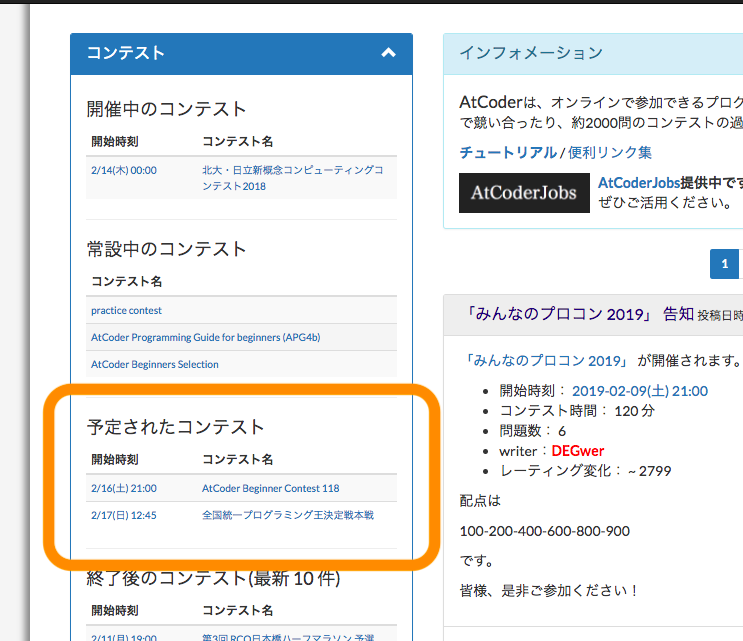
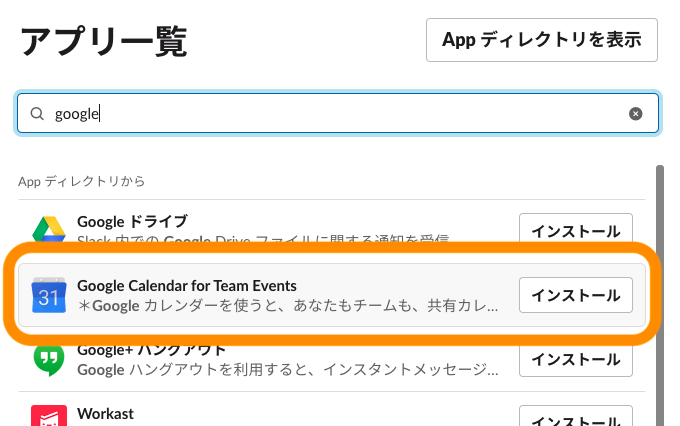

# AtCoder のコンテスト開催を最速で知る方法
## はじめに
AtCoder のコンテストは基本毎週1個、休日に開かれます。  
開催されない週があったり、土曜だったり日曜だったりします。

休日の予定を立てるためには日程をいち早く知ることは最重要課題です。

そこでコンテストの開催を知る手段と最速の方法をまとめました。

## コンテストの開催を知る手段
AtCoder のコンテストの開催を知る手段は、だいたい以下の3つに分けられると思います。
### 1. Twitter で知る
Twitter を見て知るという人が結構多いんじゃないかなと思います。

[AtCoder 公式アカウント](https://twitter.com/atcoder)では当日ツイートのみなので、[chokudai](https://twitter.com/chokudai) さんをフォローするのが一番速いです。

ただサービスとして、Twitter がコンテストの開催を知るメインの手段である状態は良くないと思います。  
ツイートを見逃すこともありますし、人それぞれフォローしている人数も人も違います。

そもそも Twitter やってなければ終わりです。

<b>「AtCoder のアカウントがあればコンテストの開催を最速で知ることができる」</b>状態が理想です。

### 2. メールで知る
自分の AtCoder アカウントから「コンテストメールを受け取る」にチェックを入れるとメールが届きます。

メールは基本コンテスト前日に来るので、Twitter と比べると非常に遅いです。

これでは休日の予定は立てられません。

### 3. [ホームページ](https://atcoder.jp/)を確認
ホームページ左に開催予定のコンテストが表示されています。

ここを定期的にチェックするのは現実的ではありません。

### まとめ
「公平性?」は、AtCoder のアカウントのみで完結するかということを意味します。  
消去法で Twitter になってしまいます。

|方法|コスト&確認漏れ|速さ|公平性?|
|:--|:--:|:--:|:--:|
|Twitter|△|o|x|
|メール|o|x|o|
|ホームページ|x|-|o|

## 最速の方法
<b>[AtCoder の Google カレンダー](https://atcoder.jp/calendar)</b> を使用します。  
あまり知られていないと思いますがここから飛べます。

### 必要なもの
- Google アカウント

現状「AtCoder のアカウントがあればコンテストの開催を最速で知ることができる」は無理です。

### 1. [AtCoder のカレンダー](https://atcoder.jp/calendar) を登録
ここを押して自分のカレンダーに追加します。

### 2. 通知設定
#### 2.1 カレンダー右横のマークから設定画面へ

#### 2.2 設定
イベント作成時やコンテスト開始xx分前に通知させることができます。

#### 2.3 スマホで通知
Google カレンダーのアプリを入れれば、メールではなくプッシュ通知できます。

- [iOSアプリ](https://itunes.apple.com/jp/app/google-%E3%82%AB%E3%83%AC%E3%83%B3%E3%83%80%E3%83%BC/id909319292)
- [Androidアプリ](https://play.google.com/store/apps/details?id=com.google.android.calendar)

### +α Slack と連携
Google カレンダーと Slack を連携して、指定したチャンネルに通知させます。

簡単な画面遷移は説明してないです。

#### 1. [Google Calendar for Team Events](https://slack.com/apps/A0F8149ED-google-calendar-for-team-events) を使用

#### 2. 設定
連携している Google アカウントに登録されたカレンダーの中から、<b>AtCoder コンテスト</b>を指定します。

あとはそれぞれ投稿するチャンネルとリマインダーなどを設定して完了です。

#### 3. 実際の通知
会社や学校、コミュニティなどの Slack で是非やって見てください。

### 直近のコンテストの通知時間
個人的には Twitter や Google カレンダーと同じ日にメールが来るのが理想だと思います。

#### ABC117
開催日時: <b>2019/2/3 21:00</b>

|No|方法|日時|
|:--:|:--|:--:|
|1|Twitter(@chokudai)|1/30 06:27|
|2|Google カレンダー|1/30 23:28|
|3|メール|2/3 01:35|

#### ABC118
開催日時: <b>2019/2/16 21:00</b>

|No|方法|日時|
|:--:|:--|:--:|
|1|Twitter(@chokudai)|2/10 02:22|
|2|Google カレンダー|2/10 19:23|
|3|メール|-|

## まとめ
chokudai さんが最速でした。

|方法|コスト&確認漏れ|速さ|公平性?|
|:--|:--:|:--:|:--:|
|Google カレンダー|o|o|△|
|Twitter|△|o|x|
|メール|o|x|o|
|ホームページ|x|-|o|

